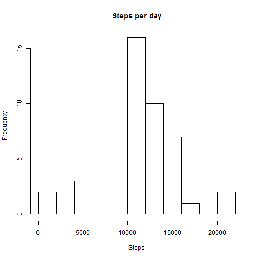
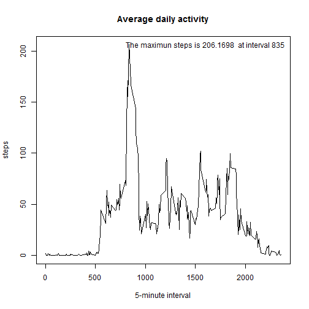
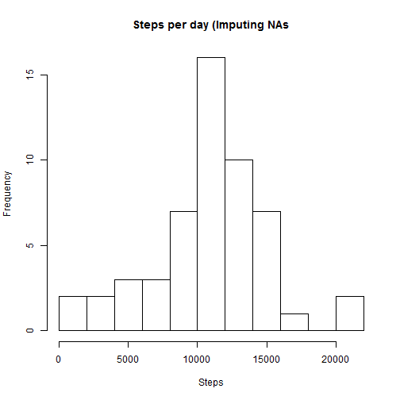

## Loading and preprocessing the data
Load the data.


```r
# Unzip and read the data file.
activity <- read.csv(unzip("activity.zip"))
```

Preproces the data.

- Create a new factor variable 'is weekend' in the dataset with two levels - "weekday" and "weekend" indicating whether a given date is a weekday or weekend day.
- For checking purposes, add a new variable 'day of week' with seven levels from Sunday to Saturday.


```r
# We want to see the day of the week in English: locale "C" reflects North-American usage.
Sys.setlocale(category = "LC_ALL", locale = "C")
```

```
## [1] "C"
```

```r
# Create a factor variable 'is weekend' in the dataset with two levels - "weekday" and "weekend".
#   In English the day of the week starting with character S are Saturday and
#   Sunday - they mark the weekend (and the rest are weekdays).
#   The 'starting with' is notated with character circumflex accent (^).
activity$is_weekend <- as.factor(as.numeric(as.factor(grepl('^S', as.factor(weekdays(as.Date(activity$date)))))))
levels(activity$is_weekend) <- c("weekday", "weekend")

# For checking purposes only, add a new variable 'day of week' with seven levels from Sunday to Saturday.
activity$weekday <- as.factor(weekdays(as.Date(activity$date)))
# .. and order them starting from Sunday (the US way).
activity$weekday <- factor(activity$weekday, 
  levels = c("Sunday", "Monday", "Tuesday", "Wednesday", "Thursday", "Friday", "Saturday"))
```

###Result dataset
Let's have a look at our dataset 'activity'.


```r
str(activity)
```

```
## 'data.frame':	17568 obs. of  5 variables:
##  $ steps     : int  NA NA NA NA NA NA NA NA NA NA ...
##  $ date      : Factor w/ 61 levels "2012-10-01","2012-10-02",..: 1 1 1 1 1 1 1 1 1 1 ...
##  $ interval  : int  0 5 10 15 20 25 30 35 40 45 ...
##  $ is_weekend: Factor w/ 2 levels "weekday","weekend": 1 1 1 1 1 1 1 1 1 1 ...
##  $ weekday   : Factor w/ 7 levels "Sunday","Monday",..: 2 2 2 2 2 2 2 2 2 2 ...
```

A sample of the data .

```r
activity[9502:9508,]
```

```
##      steps       date interval is_weekend  weekday
## 9502     0 2012-11-02     2345    weekday   Friday
## 9503     0 2012-11-02     2350    weekday   Friday
## 9504     0 2012-11-02     2355    weekday   Friday
## 9505     0 2012-11-03        0    weekend Saturday
## 9506     0 2012-11-03        5    weekend Saturday
## 9507     0 2012-11-03       10    weekend Saturday
## 9508     0 2012-11-03       15    weekend Saturday
```


## What is mean total number of steps taken per day?

**1. Calculate the total number of steps taken per day.**


```r
# With function aggregate, the default is to ignore missing values in the given variables.
steps_per_day <- aggregate(steps ~ date, data=activity, sum)
str(steps_per_day)
```

```
## 'data.frame':	53 obs. of  2 variables:
##  $ date : Factor w/ 61 levels "2012-10-01","2012-10-02",..: 2 3 4 5 6 7 9 10 11 12 ...
##  $ steps: int  126 11352 12116 13294 15420 11015 12811 9900 10304 17382 ...
```

```r
step_total <- sum(steps_per_day$steps)
step_total
```

```
## [1] 570608
```

The total number of steps taken per day is 570608.


**2. Make a histogram of the total number of steps taken each day.**

```r
hist(steps_per_day$steps, breaks=12, xlab="Steps", main="Steps per day")
```

 

**3. Calculate and report the mean and median of the total number of steps taken per day.**


```r
step_mean <- mean(steps_per_day$steps)
step_mean
```

```
## [1] 10766.19
```

```r
step_median <- median(steps_per_day$steps)
step_median
```

```
## [1] 10765
```

The measures of central tendency for steps taken are

 - the mean is 10766.19 and 
 - the median is 10765.


## What is the average daily activity pattern?

**1. Make a time series plot of the 5-minute interval and the average number of steps taken, averaged across all days.**


```r
# With function aggregate, the default is to ignore missing values in the given variables.
avg_steps_per_interval <- aggregate(steps ~ interval, data=activity, mean)
str(avg_steps_per_interval)
```

```
## 'data.frame':	288 obs. of  2 variables:
##  $ interval: int  0 5 10 15 20 25 30 35 40 45 ...
##  $ steps   : num  1.717 0.3396 0.1321 0.1509 0.0755 ...
```

```r
plot(avg_steps_per_interval, type="l", xlab="5-minute interval", main="Average daily activity")
interval_containing_max_steps <- avg_steps_per_interval[which.max(avg_steps_per_interval$steps), ]
max_text <- paste("The maximun steps is", as.character(sprintf("%.4f", interval_containing_max_steps$steps)), " at interval", as.character(interval_containing_max_steps$interval))
text(c(1600),c(206),labels=max_text)
```

 

**2. Which 5-minute interval, on average across all the days in the dataset, contains the maximum number of steps?**


```r
avg_steps_per_interval[which.max(avg_steps_per_interval$steps), ]
```

```
##     interval    steps
## 104      835 206.1698
```
The maximun steps is 206.1698  at interval 835.

## Imputing missing values

**1. Calculate and report the total number of missing values in the dataset**

```r
NA_count <- sum(is.na(activity))
NA_count
```

```
## [1] 2304
```

There are 2304 missing values.


**2. Devise a strategy for filling in all of the missing values in the dataset. **

Replace the NAs with '5-minute interval averages'

```r
activity_imp <- merge(activity, avg_steps_per_interval, by = "interval", suffixes = c("", ".na"))
# Create an index list of NAs
na_ind <- is.na(activity_imp$steps)
# Replace NAs
activity_imp$steps[na_ind] <- activity_imp$steps.na[na_ind]
```


**3. Create a new dataset that is equal to the original dataset but with the missing data filled in.**

```r
# Remove column 'steps.na' (the sixth colomn)
activity_imp <- activity_imp[, c(1:5)]
str(activity_imp)
```

```
## 'data.frame':	17568 obs. of  5 variables:
##  $ interval  : int  0 0 0 0 0 0 0 0 0 0 ...
##  $ steps     : num  1.72 0 0 0 0 ...
##  $ date      : Factor w/ 61 levels "2012-10-01","2012-10-02",..: 1 54 28 37 55 46 20 47 38 56 ...
##  $ is_weekend: Factor w/ 2 levels "weekday","weekend": 1 1 2 1 2 1 2 1 1 2 ...
##  $ weekday   : Factor w/ 7 levels "Sunday","Monday",..: 2 6 1 3 7 5 7 6 4 1 ...
```

**4. Make a histogram of the total number of steps taken each day and Calculate and report the mean and median total number of steps taken per day.**


```r
steps_per_day_imp <- aggregate(steps ~ date, data=activity_imp, sum)
hist(steps_per_day$steps, breaks=12, xlab="Steps", main="Steps per day (Imputing NAs")
```

 

```r
step_mean_imp <- mean(steps_per_day_imp$steps)
step_mean_imp
```

```
## [1] 10766.19
```

```r
step_median_imp <- median(steps_per_day_imp$steps)
step_median_imp
```

```
## [1] 10766.19
```

```r
# steps before (with NAs)
step_total
```

```
## [1] 570608
```

```r
# steps after (NAs replaces wit averages)
step_total_imp <- sum(steps_per_day_imp$steps)
step_total_imp
```

```
## [1] 656737.5
```

```r
# difference is steps 
more_steps = (step_total_imp - step_total)
more_steps
```

```
## [1] 86129.51
```

```r
str_more_steps = sprintf("%.0f", more_steps)
```


After imputing missing values, the measures of central tendency for steps taken are

 - the mean is 10766.19 (*before 10766.19*) and
 - the median is 10766.19 (*before 10765*).


The impact of imputing missing data **did not change the mean** and affected the **median only slightly**.

However, replacing the NAs added the total number of steps taken with 86130 steps.


## Are there differences in activity patterns between weekdays and weekends?


**1. Create a new factor variable in the dataset with two levels - "weekday" and "weekend"**

This was already done at the beginnig in the preprocessing phase; see variable 'is_weekend'. 

**2. Make a panel plot containing a time series plot (i.e. type = "l") of the 5-minute interval and the average number of steps taken, averaged across all weekday days or weekend days.**


```r
par(mfrow = c(2, 1))
for (is_we in c("weekend", "weekday")) {
    steps.is_we <- aggregate(steps ~ interval, data = activity_imp, subset = activity_imp$is_weekend == 
        is_we, FUN = mean)
    plot(steps.is_we, type = "l", main = is_we)
}
```

 

It seems that there is more activity on weekend than on weekdays. 
Even though the subject get's up later he/she is more active during the day (and goes to bed a maybe a bit later than on weekdays).
